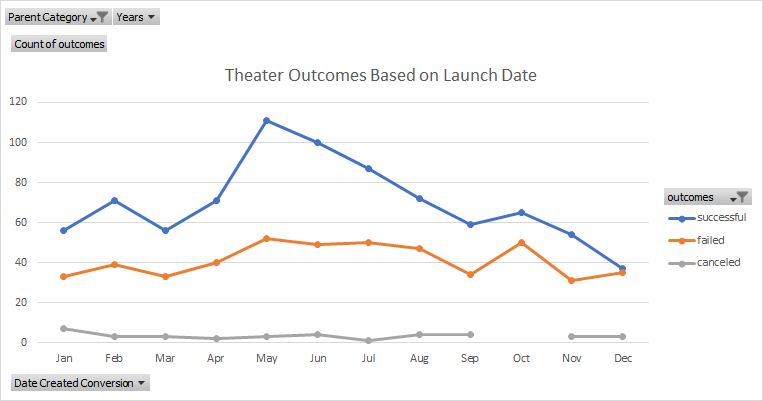
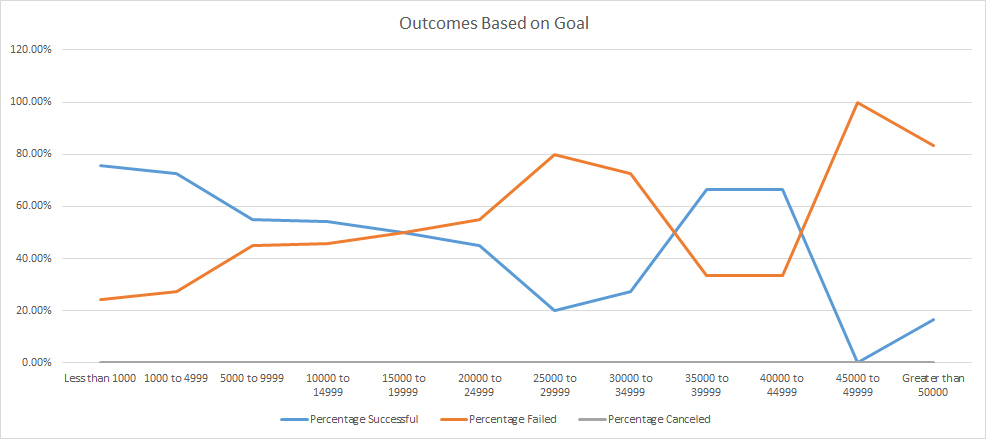

# Kickstarting with Excel

## Overview of Project
Louise would like to know how different campaigns fared in relation to their launch dates and their funding goals.

## Analysis and Challenges

### Analysis of Outcomes Based on Launch Date

The line graph above shows the number of successful, failed, or cancelled campaigns in the theater category based on their launch month through 2009 to 2017.

By comparing successful, failed and canceled theater, we find that number of theater successfully meeting their goal are the greatest based on their lauch dates. The number of successful theatres began to rise until it peaked in May, when 111 theatres had a successful release. Then the number began to decline slowly until December. To be specific, theaters launched at May has the greatest number of successfully meeting the goals.

By contrast, the number of failed theaters fluctuated less than the number of successful theaters. The number of cancellations each year is about the same. From 2009 to 2017, no more than 10 theaters were canceled based on the launch month. 

### Analysis of Outcomes Based on Goals

The line graph above illustrates information on the percentage of outcomes based on success, failure, and cancellation. Furthermore, the subcategories are limited to plays.

From the graph we can see that there are no plays has been cancelled. The highest successful rate is in the smallest range of goal, and it is declining until the range of $25,000 to $29,999. Then, the percentage of successful starts to increase from that range. We can also see that there are none of the plays managed to achieve their goals between $45,000 and $49,999.

Overall, the percentage of successful is declining while the range of the goal are increasing.

### Challenges and Difficulties Encountered
- When entering the goal range, it is very easy to missing one or two range.

## Results

1. What are two conclusions you can draw about the Outcomes based on Launch Date?
   - The number of successful theaters that meeting their goals are the greatest, especially the number of theaters successfully launched in May are the highest.
   - The number of failed and cancelled theatres fluctuated more steadily than that of successful theatres.

2. What can you conclude about the Outcomes based on Goals?
   - As the range of goals increased, the percentage of success decreased.

3. What are some limitations of this dataset?
   - 

4. What are some other possible tables and/or graphs that we could create?
