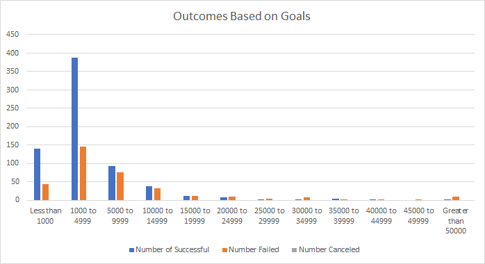

# Kickstarting with Excel

## Overview of Project
Louise would like to know how the different fundraising campaigns relate to each other in terms of their launch dates and fundraising goals. Firstly, we can analyze the relationship between different theaters based on their release months, such as whether the month is associated with success in meeting fundraising goals. Secondly, we analyze the relationship based on different fundraising goals. We will divide the fundraising goals into different ranges to analyze the relationship between different fundraising target ranges and fundraising success rate.

## Analysis and Challenges

### Analysis of Outcomes Based on Launch Date

The line graph above shows the number of successful, failed, or cancelled campaigns in the theater category based on their launch month through 2009 to 2017.

By comparing successful, failed and canceled theater, we find that number of theater successfully meeting their goals are the greatest based on their lauch dates. The number of successful theatres began to rise until it peaked in May, when 111 theatres had a successful release. Then the number began to decline slowly until December. To be specific, theaters launched in May has the greatest number of successfully achieving the goals. Furthermore, in June, July and August, the number of successful fundraising was higher than average. This may be due to the season. May to August is summer and there will be summer holidays, which are the peak seasons. Compared with winters, more people will go out for activities, so more theater fundraising campaign have succeffully raised funds during this period.

By contrast, the number of failed theaters fluctuated less than the number of successful theaters. The number of cancellations each year is about the same. From 2009 to 2017, no more than 10 theaters were canceled based on the launch month. 

### Analysis of Outcomes Based on Goals

The line graph above illustrates information on the percentage of outcomes based on success, failure, and cancellation. Also, the subcategories are limited to plays.

From the graph we can see that there are no plays has been cancelled. The highest success rate is within the minimum target range and has been declining until it is betweeen the range of $25,000 to $29,999. Therefore, small range of fundraising goals are easier to achieve. As the range of fundraising goals increases, the success rate will slowly decrease. Then, the percentage of successful starts to increase from that range. This may be because some high-quality plays require more fundraising, and people are willing to raise money for their qualities. We can also see that there are none of the plays managed to achieve their goals between $45,000 and $49,999 because the fundraising goal are way to high.

Overall, the small target range has the highest success rate and the lowest failure rate, but as the range of fundraising increases, the success rate will slowly decrease.

### Challenges and Difficulties Encountered
During this assignment, the challenge I found was that it was easy to miss or mistype the goal range when entering the goal range for Analysis of Outcomes Based on Goals, and I could not find a way to let excel automatically divide the range for us. So, if the data is large enoufh, this will greatly affect our speed and accuracy.

## Results

### Conclusions
1. The two conclusions I found about the Outcomes based on Launch Date are:
   - The number of successful theaters that meeting their goals are the greatest, especially the number of theaters successfully launched in May to August are higher than average of the year.
   - The number of failed and cancelled theatres fluctuated more steadily than that of successful theatres.

2. The conclusion about the Outcomes based on Goals is: 
   - As the range of goals increased, the percentage of success decreased.

### Limitations of the Dataset and Recommendations
In the Analysis of Outcomes based on Goals, we only know the percentages of success, failure, and cancellation based on different fundraising range. But we need to know the number of successful, failed and cancelled to help us better understand in which fundraising ranges more people are willing to raise funds. We can use a bar graph to visualize it more clearly.

From the bar graph above, we found out that there are more people willing to fundraise in the range between $1,000 to $4,999. This may tell us that most people think it is enough to make a play in this fund range.
